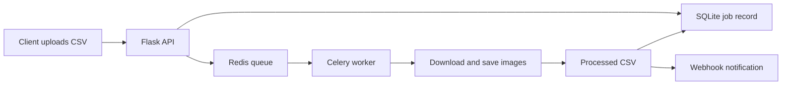

# Asynchronous Image Processing API
<p align="center">
  
</p>

<p align="center"><em>Project-themed banner generated from an internet-hosted image service for a cleaner GitHub presentation.</em></p>

A Flask and Celery backend that accepts image URLs in a CSV file, processes the images in the background, records job state in SQLite, and sends a completion webhook.

## Overview

The API separates request handling from image work so an upload can return immediately with a tracking ID. A Celery worker downloads each image, saves a compressed version, writes the resulting paths to a new CSV, and updates the job status.

## Architecture



## Features

- CSV upload through a REST endpoint
- UUID-based request tracking
- asynchronous processing with Celery and Redis
- SQLite persistence with Flask-SQLAlchemy
- image download and quality reduction with Pillow
- processed CSV generation
- completion webhook
- included Postman collection and sample CSV

## API

### Upload a CSV

```http
POST /upload
Content-Type: multipart/form-data
```

Form field: `file`

Expected CSV columns:

```csv
Serial Number,Product Name,Input Image Urls
1,SKU1,"https://example.com/image-1.jpg,https://example.com/image-2.jpg"
```

Successful response:

```json
{
  "request_id": "123e4567-e89b-12d3-a456-426614174000"
}
```

### Check job status

```http
GET /status/<request_id>
```

The response contains `Pending`, `Processing`, or `Completed`. Completed jobs also include the generated CSV path.

## Tech Stack

- Python
- Flask and Flask-SQLAlchemy
- Celery
- Redis
- SQLite
- Pandas
- Pillow
- Requests

## Project Structure

```text
.
|-- app.py
|-- celery_worker.py
|-- config.py
|-- models.py
|-- tasks.py
|-- webhook.py
|-- sample.csv
|-- requirements.txt
|-- Asynchronous Image Processing API - Flask & SQLite.postman_collection.json
`-- README.md
```

The `uploads/` directory and SQLite tables are created at runtime.

## Installation

```bash
git clone https://github.com/guru8880/Asynchronous_Image_Processing-API.git
cd Asynchronous_Image_Processing-API
python -m venv venv
```

```bash
# Windows
venv\Scripts\activate

# macOS/Linux
source venv/bin/activate
```

```bash
pip install -r requirements.txt
```

Start Redis, then run the API and worker in separate terminals:

```bash
python app.py
```

```bash
celery -A celery_worker.celery worker --loglevel=info --pool=solo
```

The API is available at `http://127.0.0.1:5000`.

Before processing real jobs, replace the placeholder `WEBHOOK_URL` in `webhook.py`.

## Current Limitations

- output files are returned as local paths; there is no download endpoint or object storage
- failed image downloads do not have retries or per-image error reporting
- webhook configuration is hard-coded
- SQLite and a local uploads directory are intended for development-scale use
- uploaded URLs should be validated before exposing this service publicly

## Future Improvements

- add Docker Compose for Flask, Redis, and Celery
- introduce task retries, timeouts, and structured failure states
- store images in cloud object storage
- authenticate clients and validate input URLs
- add automated API and worker tests
